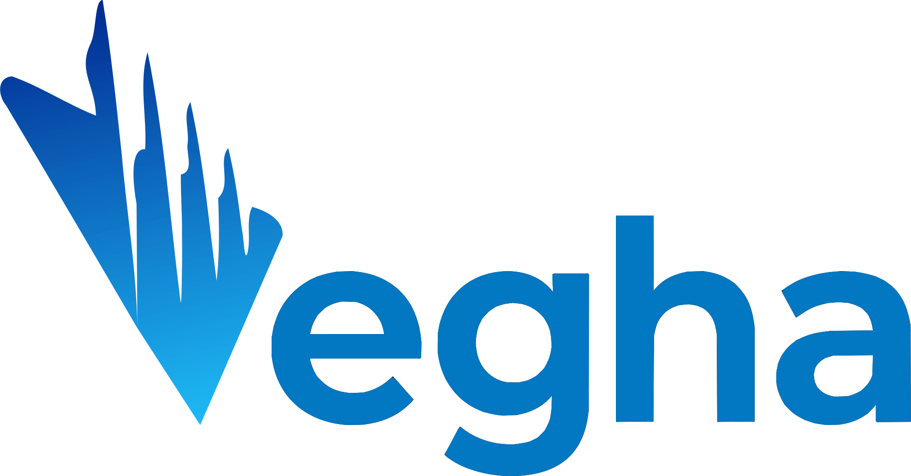

<div align="center">



# Vegha

**A cross-platform, native, MIT-licensed API testing desktop app.**
Bruno-class engine. Enterprise-class polish. Fully local. Zero telemetry.

[Features](#features) · [Install](#install) · [Build](#build) · [Shortcuts](#keyboard-shortcuts) · [Privacy](#privacy)

</div>

---
## Why Vegha

The desktop API-testing category is crowded with Electron apps that boot slowly, eat memory, and quietly phone home. Vegha is a fresh alternative:

-  &nbsp; **Native binary** — Avalonia + .NET 10, starts fast, stays responsive under load, smaller memory footprint.
-  &nbsp; **Local-first, zero telemetry, no phone-home** by default.
-  &nbsp; **File-system-folder workspaces**, optionally git-backed — your collections are plain-text Bruno-style `.bru` files.
-  &nbsp; **MIT-licensed.** Use it, fork it, ship it commercially.
-  &nbsp; **Enterprise-ready** out of the box: SSO-brokered auth flows, secret-manager bindings, native git, mTLS, OAuth2 in the system browser.

---

## Features

<table>
<tr>
<td width="50%" valign="top">

###  &nbsp; Request execution
- HTTP / REST
- GraphQL
- gRPC — unary **+ all streaming modes**
- WebSocket
- SOAP 1.1 / 1.2 with WSDL
- Per-request retry & timeout
- Connection timeline (DNS / connect / TLS / TTFB)
- Cookie jar, redirects, system proxy
- TLS client certificates

</td>
<td width="50%" valign="top">

###  &nbsp; Authentication
- API Key · Bearer · Basic · Digest · NTLM · OAuth1
- OAuth2 — authorization-code + PKCE, client-credentials, password
- AWS SigV4 · WSSE UsernameToken · mTLS

OAuth2 authorization-code runs through the **system browser** with a loopback listener and a local token cache — no embedded webview.

</td>
</tr>
<tr>
<td width="50%" valign="top">

###  &nbsp; Variables & environments
- `{{variable}}` interpolation with **cycle detection**
- Collection / environment / workspace scopes
- Mock data functions — `{{$randomInt}}`, `{{$guid}}`, `{{$timestamp}}`, …

</td>
<td width="50%" valign="top">

###  &nbsp; Scripting & testing
- Pre-request and post-response scripts in a **sandboxed JS engine** (Jint)
- The `bru` / `req` / `res` API
- Test assertions with a dedicated Test Results view
- Hard limits: memory / time / recursion
- **No filesystem, no process access** from scripts

</td>
</tr>
<tr>
<td width="50%" valign="top">

###  &nbsp; Collections & import
- **Bruno-style `.bru`** collection format — plain-text, human-readable, git-friendly
- Importers:
  - Bruno `.bru`
  - Postman v2 / v2.1 (collections + environments)
  - Insomnia v4 / v5
  - OpenAPI 3.x / Swagger 2.0
  - WSDL → executable SOAP collection
- OpenAPI **sync** with drift detection

</td>
<td width="50%" valign="top">

###  &nbsp; Git (native UI)
- Init · clone · branch · checkout · stage
- Commit · push · pull · stash · diff
- **Three-pane merge-conflict resolver**

Backed by **LibGit2Sharp** — no external git required. HTTPS PAT + SSH-key auth via the OS keystore.

</td>
</tr>
<tr>
<td width="50%" valign="top">

###  &nbsp; Secret managers
Reference secrets from environment variables with the `secret://provider/path#field` URI scheme — resolved at send time, never written to disk:

- **Azure Key Vault** — Entra ID service principal, or Azure CLI / managed identity
- **AWS Secrets Manager** — IAM access keys, or the AWS default credential chain

More providers (HashiCorp Vault, GCP Secret Manager, Doppler, 1Password, CyberArk Conjur) are planned.

</td>
<td width="50%" valign="top">

###  &nbsp; Code generation
Generate equivalent request code in:

- **curl** · Node `fetch` · Python `requests`
- Go `net/http` · C# `HttpClient` · Java OkHttp

</td>
</tr>
<tr>
<td width="50%" valign="top">

###  &nbsp; Workspaces & platform
- File-system-folder workspaces — optionally **git-backed**
- Light and dark themes (+ optional Liquid Glass on macOS)
- Native Windows and macOS desktop builds
- Headless CLI: `vegha run / import`
- VSCode plugin *(planned, v2)*

</td>
<td width="50%" valign="top">&nbsp;</td>
</tr>
</table>

---

## Install

> Pre-built installers ship once we hit MVP.
> Until then, build from source — see [Build](#build).

### Direct download *(planned)*

Signed installers with **Velopack auto-update**:

| Platform | Format |
| --- | --- |
| Windows | `.exe` installer + portable `.zip` |
| macOS   | Universal `.dmg` (Apple-silicon + Intel) |
| Linux   | `.AppImage`, `.deb`, `.rpm` |

### Store builds *(planned)*

- **Microsoft Store** — MSIX, Store-managed updates
- **Mac App Store** — sandboxed, signed `.pkg`

---

## Build

**Prerequisites:** the [.NET 10 SDK](https://dotnet.microsoft.com/download) — that's it. There are no native build dependencies, and git operations are handled in-process by LibGit2Sharp.

Clone the repo and build the full solution:

```bash
git clone https://github.com/vamsimaddirala/Vegha.git
cd Vegha

dotnet restore
dotnet build          # Debug build of every project
dotnet test           # run the unit + integration suites
```

For an optimized build, add `-c Release` to `dotnet build`.

### Run the desktop app

```bash
dotnet run --project app/Vegha.App
```

### Run the headless CLI

The CLI shares the same engine as the desktop app. Run it with no arguments to print the verb list:

```bash
dotnet run --project cli

# Import an OpenAPI / Postman / Insomnia file into a collection folder
dotnet run --project cli -- import samples/openapi/petstore.json ./petstore

# Execute that collection — add --name "<request>" to run a single request
dotnet run --project cli -- run ./petstore
```

### Packaged builds

Signed installers and store packages (Velopack, MSIX, MAS) are produced by the scripts in [`eng/`](eng) together with the GitHub Actions workflows in [`.github/workflows/`](.github/workflows).

---

## Repo layout

```
.
├── app/             # Desktop UI (Avalonia 11) + Core engine projects
├── cli/             # Headless CLI — same engine as the UI
├── plugin-vscode/   # VSCode extension (planned, v2)
├── samples/         # Sample collections (Bruno petstore, OpenAPI petstore)
├── docs/            # README icons and assets
└── eng/             # Build / packaging scripts (Velopack, MSIX, MAS)
```

---

## Keyboard shortcuts

Shortcuts use **Ctrl** on Windows / Linux and **⌘** on macOS.
The in-app menus, the **Help → Keyboard shortcuts** dialog, and the **Settings → Shortcuts** page all render the gesture for whichever OS you're running on.

| Action                        | Windows / Linux                | macOS              |
| ----------------------------- | ------------------------------ | ------------------ |
| New request                   | `Ctrl + T`                     | `⌘ T`              |
| Open collection               | `Ctrl + O`                     | `⌘ O`              |
| Import                        | `Ctrl + I`                     | `⌘ I`              |
| Settings                      | `Ctrl + ,`                     | `⌘ ,`              |
| Save request                  | `Ctrl + S`                     | `⌘ S`              |
| Find request                  | `Ctrl + K`                     | `⌘ K`              |
| Send request                  | `Ctrl + Enter`                 | `⌘ ↩`              |
| Next / previous tab           | `Ctrl + Tab` / `Ctrl+Shift+Tab`| `⌘ Tab` / `⌘⇧Tab`  |
| Close tab                     | `Ctrl + W`                     | `⌘ W`              |
| Zoom in / out / reset         | `Ctrl + =` / `-` / `0`         | `⌘ =` / `-` / `0`  |

---

## Privacy

> **Zero telemetry. Zero crash reporting. Zero phone-home.**

The **only** outbound traffic Vegha ever issues is:

1. The test requests you explicitly send.
2. The auth flows you explicitly initiate (OAuth2, OIDC discovery, etc.).
3. *In direct-download builds only* — periodic Velopack update checks.

There is no opt-out toggle because there is nothing to opt out of. MSIX and Mac App Store builds defer updates entirely to the store and skip step 3.

---

## Distribution

Three build flavors from a single codebase:

| Flavor    | Channel                    | Updates                |
| --------- | -------------------------- | ---------------------- |
| Direct    | github.com releases page   | Velopack (in-app)      |
| MSIX      | Microsoft Store            | Store-managed          |
| MAS       | Mac App Store (sandboxed)  | Store-managed          |

---

## License

**MIT** — see [`LICENSE`](LICENSE).
Free to use, modify, and distribute, including commercially.

---

## Acknowledgements

Vegha's request engine and importer logic is derived in part from **[Bruno](https://github.com/usebruno/bruno)** (MIT), and the UI is built on **[Avalonia](https://avaloniaui.net/)**.

A long tail of incredible OSS makes this possible — see [`THIRD_PARTY.md`](THIRD_PARTY.md) for the full attribution list.

---

<div align="center">
<sub>Built with care for people who live in their API client all day. ⌥</sub>
</div>
